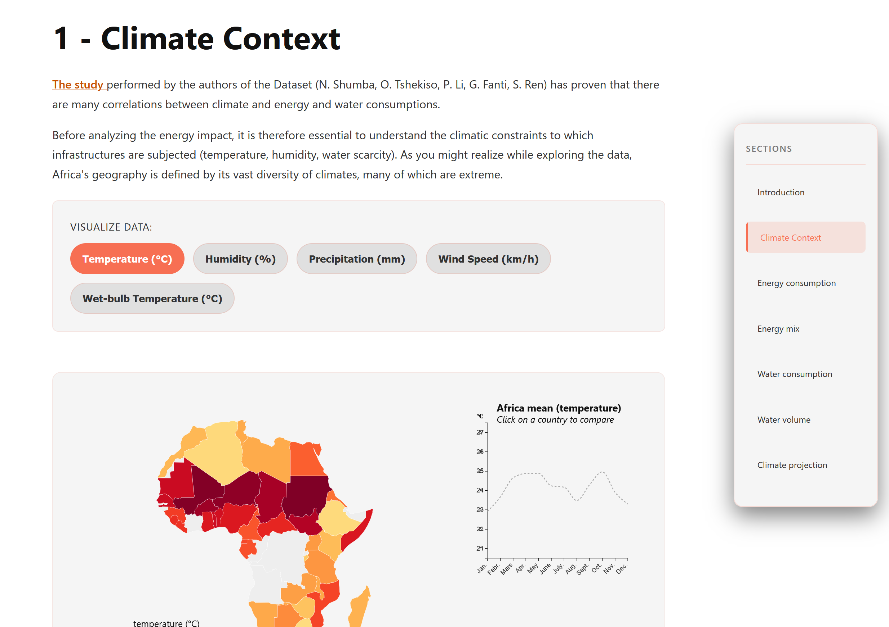

# Water Efficiency in African Data Centers

### DataViz project – Lyon 1 University, Master IA (2025–2026)

[Project site (GitHub Pages)](https://deankoontzg.github.io/DataViz_EVGA/)



---

## Description
This data visualization explores how **energy consumption**, **climate conditions**, and **water efficiency (WUE)** interact in **data centers across Africa**.  
It aims to reveal how different **climate regions** and **energy mixes** (renewables vs. fossil fuels) impact the **water footprint** of data centers and AI infrastructure.

Through interactive D3.js visualizations, the project highlights:
- Which countries consume the most electricity,
- How their water usage efficiency compares,
- The influence of temperature, humidity, and leakages on performance.

---

## Goals
- Understand the environmental impact of AI computing and data centers in Africa.  
- Promote awareness about sustainable water management in the energy and tech sectors.  
- Provide an educational and policy-oriented visualization accessible to the public.

---

## Tech stack
- **Frontend:** HTML, CSS, JavaScript  
- **Visualization:** D3.js v7  
- **Hosting:** GitHub Pages (.io)  

---

## Visualizations
1. **Map of Africa:** Energy consumption intensity (Total Energy – TWh), with tooltip showing the national energy mix.  
2. **Scatterplot:** Relationship between renewables share and indirect water usage efficiency (WUE Indirect).  
3. **Boxplot:** Cooling water efficiency (WUE Direct) by climate region.  
4. **Bar chart:** Water losses due to leakages per country.

---

## Installation & Setup
1. Clone the project

```bash
git clone https://github.com/DeankoontzG/DataViz_EVGA.git
cd DataViz_EVGA
```

2. Create the Conda environment

Make sure you have Conda installed.

```bash
conda env create -f environment.yml
```

Then activate it:

```bash
conda activate WEA
```

3. Run a local development server

The visualization uses HTML + D3.js, so a static server is required.
If Node.js is installed (included in the environment):

```bash
npx http-server .
```

Then open:

```bash
http://localhost:8080
```

---
## Structure of the Projet

```
DataViz_EVGA/
│
├── index.html              # Interface pricipale
├── site.png                
├── README.md               # Project documentation
├── requirements.txt        # Python Requirements 
├── .gitignore              # To avoid importing whole dataset, .DS files, etc
│
├── data/                      # Contains data extracted from initial dataset
│ └── exported
│   └── climate_summary.csv          # Overall climate data
│   └── country_month_cleaned.csv    # Data aggregated by month
│   └── country_year_cleaned.csv     # Data aggregated by year
│
├── notebooks/
│ ├── 2_data_exploration_improved_V2.ipynb # Data exploration, cleaning and aggregation notebook
│
└── style/
│ └── styles.css                # Centralized styles file for coherence between visulaizations
│
└── visualizations/             
│ └── energy_mix/               # energy mix 100% stacked bar chart
│   └── energy_mix.js
│   └── index.html
│ └── map_climate/              # Choroplet map of climate data, per country and over time
│   └── map_climate.js
│   └── index.html
│ └── map_energy_total/         # Choroplet map of energy consumption. Not retained for final storytelling
│   └── map_energy_total.js
│   └── index.html
│ └── map_seasonal_impact/      # Animated choroplet map of water efficiency per country
│   └── map_seasonal_impact.js
│   └── index.html
│ └── predictive_maps/          # Animated waterfall chart and choroplet map, projection of evolution according to rise in temperature
│   └── map_seasonal_impact.js
│   └── index.html
│ └── shared/
│   └── custom.geo.json         # Geo file mapping africa and its countries used for all our maps     
│ └── stacked_area/             # Stacked area of energy consumption. Not retained for final storytelling
│   └── stacked_area.js
│   └── index.html
│ └── total_energy_volume/      # Bar chart of total energy consumption per country associated to Data Centers
│   └── total_energy_volume.js
│   └── index.html
│ └── total_water_volume/       # Stacked bar chart of water volume consumed per country associated to Data Centers
│   └── total_water_volume.js
│   └── index.html  

```

---

## Team
- Edgar Demeude
- Ghuilhem Dupuy
- Vu Anh Duy
- Vincent Joulain

---

## Credits & Sources
- Dataset: [Water Efficiency Dataset for African Data Centers](https://huggingface.co/datasets/masterlion/WaterEfficientDatasetForAfricanCountries)
- Visualization framework: [D3.js v7](https://d3js.org/)

---

## Links
- [DataViz Course – Université Lyon 1](https://lyondataviz.github.io/teaching/lyon1-m2/2025/)
- [Project site (GitHub Pages)](https://deankoontzg.github.io/DataViz_EVGA/)

---

© 2025-2026 – Lyon 1 University – Data Visualization Project
